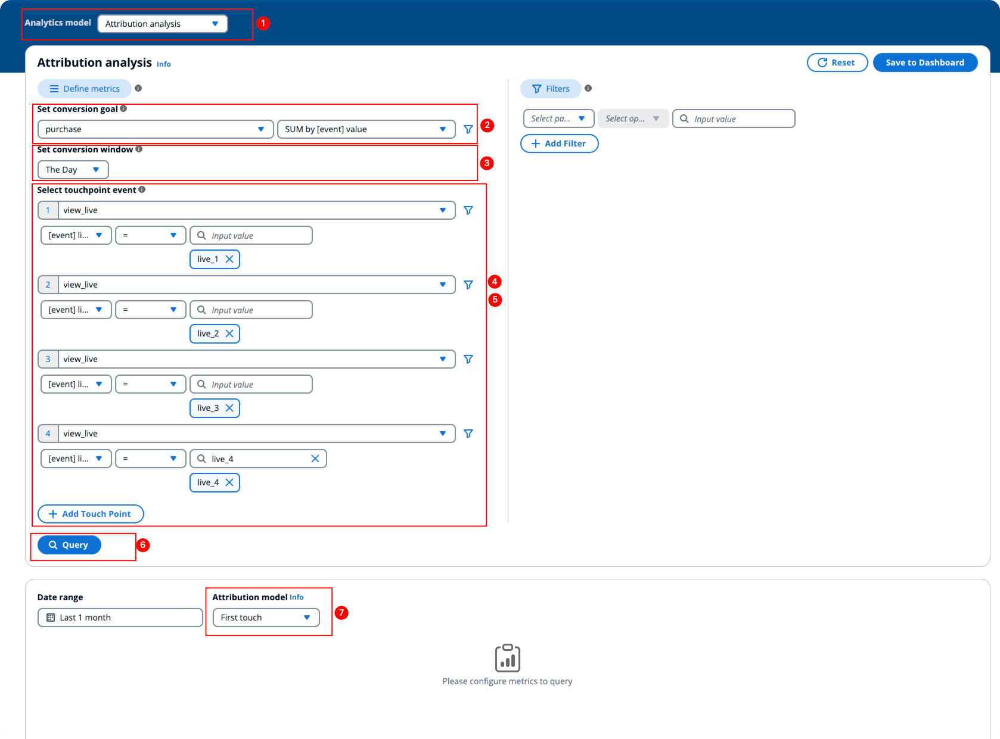

# Attribution Analysis
Attribution analysis is an analytics technique to assign credit to the touchpoint in user conversion journeys for a conversion goal. It allows you to understand the importance of different touchpoints for a specific goal in your website and apps.

## Use cases
Attributions analysis are commonly used when analyzing the contribution of specific touchpoints, for example:

- Identify the most important promotion slots within an app/website in terms of their contribution to a purchase goal;
- Identify the most important traffic channels for an app/website based on the contribution to a conversion goal

## Key concepts

- **Conversion goal**: A quantifiable metric that the app owner wants to achieve, e.g., number of purchase, purchase value, registration user number.
- **Touchpoint**: Events that app owner designed in the user journey to drive user towards the conversion goal, e.g., page_view, product exposure, button_click.
- **Attribution models**: Attribution models are a set of rules or data-driven algorithms used to determine how conversions are assigned to touchpoints on the conversion path. There is no one-fits-all model, choose one base on your scenario. {{solution_name}} supports the following models:

| Models | Definition | Applicable scenario | Consideration |
| --- | --- | --- | --- |
| First-Touch Attribution | The first attribution touchpoint in completing a goal event receives 100% contribution. | For example, in the early testing phase of the homepage flash sales, the initial traffic source plays the most important roles. | Amplifies the value of the traffic source, underestimates the output of other touchpoints. |
| Last-Touch Attribution | The last attribution touchpoint in completing a goal event receives 100% contribution. | Helps understand which touchpoint led to the final decision for a transaction. | May underestimate certain touchpoints that are not closed to conversion event, but avoids the bias towards high-traffic touchpoints seen in the first-touch model. |
| Linear Attribution | All attribution touchpoints in completing a goal event evenly share the contribution (each gets an equal share). | Treats each touchpoint equally, some touchpoints may consistently serve as intermediary touchpoints. Evaluate if certain touchpoints with long chains can be eliminated or optimized. | Tends to favor touchpoints clicked frequently by users, amplifying their value (e.g., in search and recommendations). |
| Position-Based Attribution | The first and last attribution touchpoints each receive 40% contribution, while the remaining positions evenly share the remaining 20%. | Aims to distribute value across all touchpoints but emphasizes the importance of the first and last touchpoints. Acknowledges the significance of these two touchpoints compared to others. | Subject to human bias factors. |

## How to use
1. Select an event and metric as conversion goal, you can add filter. Metric types includes:
    1. Event number: number of conversion times
    2. SumGroup: sum a value from a numerical parameter that are associated with the event selected as conversion goal
2. Select touchpoint events, you can add filter(s) to each touchpoint.
3. Click on Query to start calculation
4. You can change the time range or attribution model according to your need, which will automatically re-run the query.
5. Analysis result is displayed in a table with the following columns:
    1. Touchpoint Name: The touchpoint event name for attribution.
    2. Total Trigger Count: Number of times the touchpoint has been triggered within the specified conversion window.
    3. Number of Triggers with Conversion: Within the conversion window, number of time the touchpoint occurred simultaneously with the conversion goal.
    4. Contribution (number/sum...value): The contribution value of this touchpoint attributed to the conversion goal based on the selected model. 
    5. Contribution Rate: After calculating through the attribution model, the percentage contribution of this touchpoint to the overall total. The calculation logic is the conversion goal metrics under the current attributed event divided by the sum of all conversion goals.

## Example

> Assuming you have four live-streaming channels on your website, now you want to understand which channel contribute the most for the total purchase amount. 

1. Select the **Attribution Analysis** model.
2. Choose `purchase` as the conversion event, choose `sumGroup` by `[event]value` as conversion metric
3. Choose `The day` as conversion window.
4. Select `view_live` as touchpoint event, add filter of `live_id` = `live_1`.
5. Repeat step 4 to add touchpoints for the rest of two live channel.
6. Click **Query**.
7. Select `Last touch` model to see the attribution results.  

All configurations are as shown in the image below:

