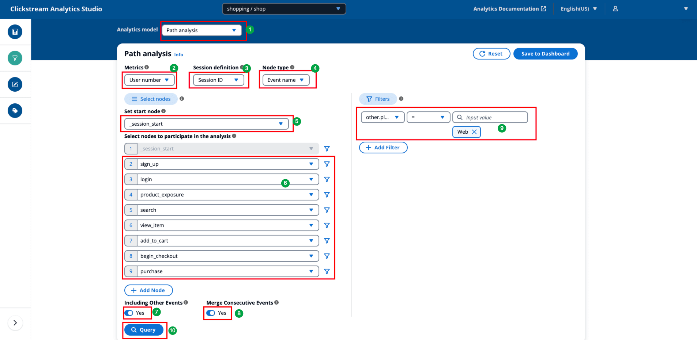

# Path Analysis
Path analysis refers to the distribution of the behavior of a group of users after sorting them in sequential order. It is mainly used to analyze and record the distribution ratio of users between pages or events. For example, check how many customers clicked on the product list after opening the app, how many customers viewed the product detail page after visiting landing page, how many customers searched for the product, etc. 

## Use cases
Path analysis are commonly used when analyzing user navigation pattern, for example:

- Analyze the behavioral path distribution of users after entering the product or arriving at landing page;
- Analyze the transition steps or screen within a specific processes (such as registration, login, payment, etc.) or product modules.

## Key concepts

- **Metric**: the entity used for path analysis, including event number or user number.
- **Session**: the length of the path analysis session, only the events happened within the session can form a path, events happened in different path will not be counted in the same path.
- **Node**: a node in the path can be an event, screen, or page.
- **Starting node**: the starting point of the path analysis.

## How to use

1. Select a metric type. 
    1. User number: calculate the number of distinct users pass through the entire path.
    2. Event number: calculate the number of completion of the entire path.
2. Configure the session.
    1. Session ID: Use the session generated by the SDK as the session for path analysis, only the events happened with the same session ID could be counted as a path.
    2. Custom: you can define any duration as the path analysis session.
3. Specify the type of node for the path.
    1. Event name: use event as a node, e.g., _page_view, screen_view.
    2. Screen name: use the name of a screen in the App as a node.
    3. Screen ID: use the class ID of a screen in the App as a node.
    4. Page title: use the page title as a node
    5. Page url: use the page url as a node
4. Set a starting node. The start node will be the first node of the path, only event happen after the node will be counted into the path.
    1. Show all nodes: display all nodes that follow the starting node.
    2. Show selected nodes: display the selected nodes only, other nodes could be grouped as 'others'.
5. When choose "Show selected nodes", you need specify nodes to participate in the analysis. Only node selected will be highlighted as nodes in the path. You can add up to 10 nodes.
6. Specify if you want to include other nodes in the path, if this option is toggled on, all the nodes that are not selected will be counted and display as "Other" in the path.
7. Specify if you want to merge consecutive nodes, if this option is toggled on, nodes that are repeated continuously in the same session will be merged into a single node.
8. If needed, configure global filter by selecting event parameter or user attributes. Similar to event filter, you can add multiple global filters and configure the filter relationship.
9.  Click on `Query` button to start the analysis. 
10. Adjust query time range if needed.
11. Click on `Save to Dashboard` to save the analysis to a Dashboard, input a name, description, and select a dashboard and sheet.

## Example

> Calculate the distribution of events triggered by customers on the web after the session starts, focusing on login, registration, product exposure, search, viewing products, adding to cart, starting checkout, and placing an order, as well as all other events.

1. Select the **Path Analysis** model.
2. Choose `User number` as the metric.
3. Choose `Session ID` as the session definition.
4. Choose `Event` as the node type.
5. In the left **Select Nodes** area, choose `_session_start` as the starting node.
6. Select `Show selected nodes`
7. Choose `sign_up`, `login`, `product_exposure`, `search`, `view_item`, `add_to_cart`, `begin_checkout`, `purchase` in sequence as path nodes.
8. Enable **Include Other Events**.
9. Enable **Merge Consecutive Events**.
10. Configure a global filter in the right **Filters** area:
    - Choose `Event preset` / `Platform` as the filter property.
    - Operation: `=`
    - Value: `Web`
11. Click **Query**.

All configurations are as shown in the image below:

