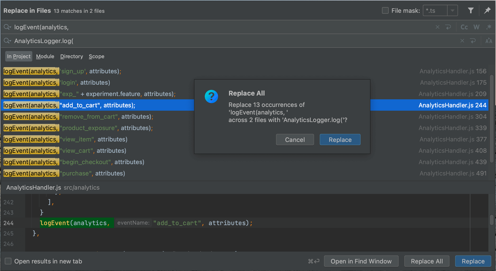

# Migrate from third-party SDKs

## Introduction

This article provides a best practice for you to migrate from a third-party SDK to Clickstream SDK. If you already have an SDK in your app or website, and you want to replace it with Clickstream SDK, we recommend you adopt this practice, which allow you to achieve a smooth migration with the following benefits:

* Minimum code changes
* Reuse existing data tracking codes
* Quick implementation time
* Dual measurement to ensure data completeness

In summary, we recommend you create one overarching analytic logger function that encapsulates all the event logging methods from both legacy SDK and Clickstream SDK, so that you have one API to log event data to multiple destinations. Once satisfied with the data, you can easily update the function to disable the legacy SDK data logging.

To make it easier to understand, we will use Clickstream Web SDK to replace Firebase Web SDK (GA4 SDK) as an example to illustrate. Assuming you have integrated Firebase Web SDK into your website, follow the steps below.

## Step 1: Integrate Clickstream Web SDK

### Include SDK

```bash
npm install @aws/clickstream-web
```

### Initialize the SDK

Copy your configuration code from your clickstream solution web console. We recommend you add the code to your app's root entry point, for example `index.js/app.tsx` in React or `main.ts` in Vue/Angular. The configuration code should look as follows.

```typescript
import { ClickstreamAnalytics } from '@aws/clickstream-web';

ClickstreamAnalytics.init({
   appId: "your appId",
   endpoint: "https://example.com/collect",
});
```

## Step 2: Encapsulate common data logger methods

When integrating multiple data analysis SDKs, it is strongly recommended that you encapsulate all event-logging methods in one function.  Processing data logging codes of different SDKs in the same place can make the code concise and easy for you to maintain. Below is an example of our encapsulation that you can copy directly into your project.

```javascript
import { ClickstreamAnalytics } from "@aws/clickstream-web";
import { getAnalytics, logEvent, setUserProperties, setUserId } from "firebase/analytics";

export const AnalyticsLogger = {

  log(eventName, attributes, items) {
    attributes = attributes ?? {}
    const {["items"]: items, ...mAttributes} = attributes;
    
    // Clickstream SDK
    ClickstreamAnalytics.record({
      name: eventName,
      attributes: mAttributes,
      items: items
    })

    //Firebase SDK
    const analytics = getAnalytics();
    logEvent(analytics, eventName, attributes);
  },

  setUserAttributes(attributes) {
    // Clickstream SDK
    ClickstreamAnalytics.setUserAttributes(attributes);

    // Firebase SDK
    const analytics = getAnalytics();
    setUserProperties(analytics, attributes);
  },

  setUserId(userId) {
    //Clickstream SDK
    ClickstreamAnalytics.setUserId(userId)

    //Firebase SDK
    const analytics = getAnalytics();
    setUserId(analytics, userId);
  },
}
```

We need to encapsulate three APIs `log()`, `setUserAttributes()` and `setUserId()`, that's all. When we invoke the `AnalyticsLogger.log('testEvent')`  method, both Clickstream and Firebase SDK will log the event, so we only need to call the `AnalyticsLogger` API when you need to log event data.

## Step 3: Migrate to common APIs in minutes

### For log events

```javascript
  onSignedUp(user) {
    let attributes = {
      _user_id: user.id,
      username: user.username,
      email: user.email,
    };
--  logEvent(analytics, 'sign_up', attributes);
++  AnalyticsLogger.log('sign_up', attributes);
  }
```

For the events log API. We need to get the event name and attributes for the events log API and pass them into the new API. Of course, you can also use the "Replace in File" feature to make quick changes, as shown in the image below.

 

### For log user attributes

```javascript
  userSignedIn(user) {
--  setUserId(analytics, user.id);
++  AnalyticsLogger.setUserId(user.id);
    let attributes = {
      _user_id: user.id,
      username: user.username,
      email: user.email,
    };
--  setUserProperties(analytics, attributes);
++  AnalyticsLogger.setUserAttributes(attributes);
  }
```

For user id, replace  `setUserId()` with `AnalyticsLogger.setUserId()` .

For user attributes, replace `setUserProperties()` with `AnalyticsLogger.setUserAttributes()` .

## Summary

As we saw above, it is easy to get Clickstream SDK and Firebase SDK to work together. After these three steps, your data will be uploaded to Clickstream Analytics and Firebase, these two SDKs will work well together and will not influence each other. After you are satisfied with the data, you only need to modify the `AnalyticsLogger` file to remove or disable another SDK smoothly.
