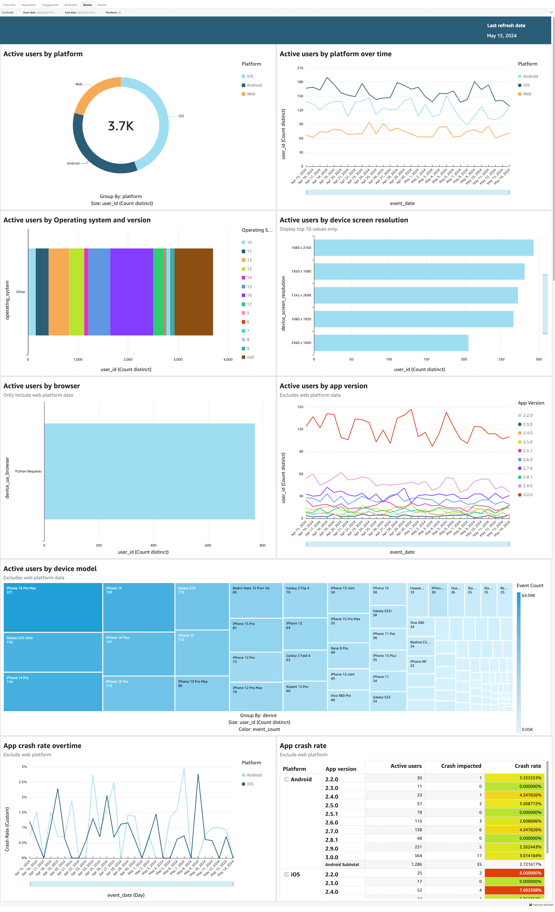

# 设备报告
设备报告提供了有关您的应用程序或网站用户使用的设备、操作系统和浏览器的见解。这些数据有助于您了解用户群体,并针对最常见的配置进行优化。

注意:本文描述了默认报告。您可以通过应用过滤器或比较,或者在QuickSight中更改维度、指标或图表来自定义报告。[了解更多](https://docs.aws.amazon.com/quicksight/latest/user/working-with-visuals.html)

## 查看报告

1. 访问您的应用程序的仪表板。请参阅[访问仪表板](index.md)
2. 在仪表板中,单击名称为**`Device`**的表。

## 数据来源

设备报告基于以下QuickSight数据集创建:

|QuickSight数据集 | Redshift视图/表| 描述 | 
|----------|--------------------|------------------|
|`Device-<app>-<project>`|`clickstream_device_user_device_view`| 此数据集存储每个用户每天的设备信息数据|
|`Crash_Rate-<app>-<project>`|`clickstream_device_crash_rate`| 此数据集存储每个应用版本每天的崩溃率数据|

## 维度

设备报告包括以下维度。

|维度 | 描述| 如何填充| 
|----------|--------------------|---------|
| 应用版本 | 应用程序的版本  | 从Clickstream SDK自动收集的`app_version`字段或通过HTTP API手动设置的字段派生而来。 |
| 设备 | 与事件关联的设备名称。 | 对于移动应用,它来自Clickstream SDK自动收集的`model_name`字段或在HTTP请求中手动设置的字段。对于Web,它是从User Agent解析的`device_ua_device`。|
| 设备屏幕分辨率 | 设备的屏幕分辨率  | `screen_width`和`screen_height`值的串联|
| 浏览器 | 浏览器的名称  | 来自从User Agent解析的`device_ua_browser`字段的值。|
| 操作系统 | 设备的操作系统。 | 对于移动应用,它来自Clickstream SDK自动收集的`platform`字段或在HTTP请求中手动设置的字段。对于Web,它是从User Agent解析的`device_ua_operating_system`。|
| 操作系统版本 | 设备的操作系统版本。 | 对于移动应用,它来自Clickstream SDK自动收集的`os_version`字段或在HTTP请求中手动设置的字段。对于Web,它是从User Agent解析的`device_ua_operating_system_version`。|

## 指标
设备报告包括以下指标。

|指标 | 定义| 如何计算| 
|----------|--------------------|---------|
| 活跃用户 | 触发任何事件的活跃用户数量。| 统计不同的user_id或user_pseudo_id(如果user_id不可用)的数量 |
| 崩溃率 | 遇到应用崩溃的用户百分比。| 出现"_app_exception"事件的不同用户数量/总活跃用户数量|

## 示例仪表板
以下图像是供您参考的示例仪表板。

