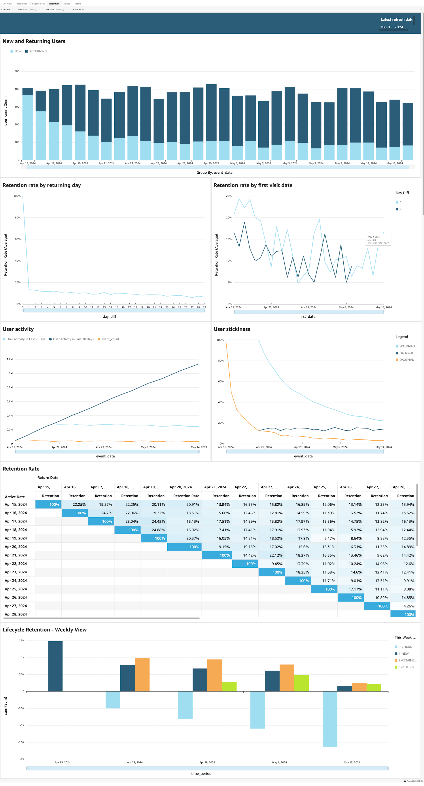

# 留存报告
您可以使用留存报告了解用户在首次访问后多久能以及多频繁地与您的网站或移动应用程序互动。这有助于您了解您的产品在吸引用户初次访问后返回的效果如何。

注意:本文描述了默认报告。您可以通过应用筛选器或比较,或者在 QuickSight 中更改维度、指标或图表来自定义报告。[了解更多](https://docs.aws.amazon.com/quicksight/latest/user/working-with-visuals.html)

## 查看报告
1. 访问您的应用程序的仪表板。请参阅[访问仪表板](index.md)
2. 在仪表板中,单击名为 **`Retention`** 的工作表。

## 数据源
留存报告基于以下 QuickSight 数据集创建:

|QuickSight 数据集|Redshift 视图/表|描述|
|----------------|-----------------|--------------------|
|`User_New_Return-<app>-<project>`|`clickstream_retention_user_new_return`|此数据集存储每天新用户数量和返回用户数量的数据。|
|`Retention_View-<app>-<project>`|`clickstream_retention_view_v3`|此数据集存储按首次访问日期和距首次访问天数分类的用户返回数据。|
|`Event_Overtime-<app>-<project>`|`clickstream_retention_event_overtime`|此数据集存储每日事件计数数据。|
|`DAU_MAU-<app>-<project>`|`clickstream_retention_dau_wau`|此数据集存储每天活跃用户的 user_id/user_pseudo_id。|
|`Lifecycle_Weekly_View-<app>-<project>`|`clickstream_retention_dau_wau`|此数据集存储每周新用户数量、留存用户数量、返回用户数量和流失用户数量的数据。|

## 指标
留存报告包括以下指标。

|指标|定义|计算方式|
|----|----|-------|
|新用户|首次访问您网站或应用程序的用户数量。|当 event_name 等于 '_first_open' 时,计算不同的 user_id 或 user_pseudo_id(如果 user_id 不可用)的数量。|
|返回用户|之前访问过您网站或应用程序的用户数量。|当 user_first_visit_date 不等于 event_date 时,计算不同的 user_id 或 user_pseudo_id(如果 user_id 不可用)的数量。|
|返回率|在该群组中返回用户占总用户的百分比。|返回用户/总用户数。|
|生命周期 - 新|本周新用户数量。|本周之前未触发任何事件的用户数量。|
|生命周期 - 留存|本周和上周均活跃的用户数量。|上周和本周均触发事件的用户数量。|
|生命周期 - 返回|至少两周之前未活跃但本周活跃的用户数量(不包括新用户)。|在至少两周前触发过事件并在本周活跃的用户数量。|
|生命周期 - 流失|上周活跃但本周不活跃的用户数量。|上周触发过事件但本周未触发任何事件的用户数量。|

## 示例仪表板
以下图像是供您参考的示例仪表板。

