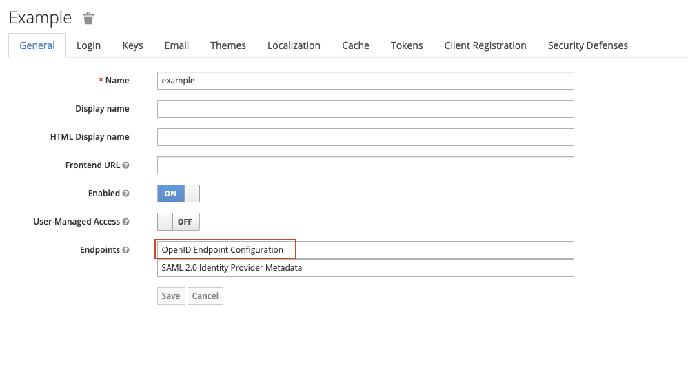

# 使用 OpenID Connect (OIDC) 进行启动

**部署时间**：大约 30 分钟

## 先决条件

!!! info "重要提示"
    {{ solution_name }} 控制台是通过 CloudFront 分发提供的，它被视为一项互联网信息服务。

    如果您在 **AWS 中国区域**部署解决方案,需要有效的[ICP备案][icp]。请查看[此文档][china-prerequisites]了解更多先决条件。

* 域名。您将使用该域名访问 {{ solution_name }} 控制台。对于 AWS 中国区域，这是必需的，而对于 AWS 区域则是可选的。
* 在 AWS IAM 中的 SSL 证书。SSL 必须与给定的域名关联。按照 [此指南](../resources/upload-ssl-certificate.md) 将 SSL 证书上传到 IAM。这仅适用于 AWS 中国区域。

## 部署概述

按照以下步骤在 AWS 上部署此解决方案。

[步骤 1. 创建 OIDC 客户端](#1-oidc)

[步骤 2. 启动堆栈](#2)

[步骤 3. 更新 OIDC 客户端的回调 URL](#3-oidc-url)

[步骤 4. 设置 DNS 解析器](#4-dns)

[步骤 5. 启动 Web 控制台](#5-web)

## 步骤 1. 创建 OIDC 客户端

您可以使用不同类型的 OpenID Connect 提供程序。本部分介绍了选项 1 到选项 4。

* (选项 1) 使用来自其他区域的 Amazon Cognito 作为 OIDC 提供程序。
* (选项 2) [Authing][authing]{target="_blank"}，这是一个第三方身份验证提供程序的示例。
* (选项 3) [Keycloak][keycloak-solution]{target="_blank"}，这是由 AWS 维护的解决方案，可用作身份验证提供程序。
* (选项 4) [ADFS][adfs]{target="_blank"}，这是 Microsoft 提供的一项服务。
* (选项 5) 其他第三方身份验证平台，如 [Auth0][auth0]{target="_blank"}。

按照以下步骤创建 OIDC 客户端，并获取 `client_id` 和 `issuer`。


### (选项 1) 使用来自其他区域的 Cognito 用户池

您可以将 [Cognito 用户池][cognito] 作为 OIDC 提供者在受支持的 AWS 区域中使用。

1. 在 AWS 区域中访问 [Amazon Cognito 控制台][cognito-console]。
2. 根据此 [指南][congnito-guide] 使用 Amazon Cognito 控制台设置托管 UI。请注意以下两个配置：
   - 在选择 **应用类型** 时选择 **公共客户端**。确保不要更改 **客户端密钥** 的选择 **不生成客户端密钥**。
   - 在 **OpenID Connect 作用域** 中添加 **Profile**。
3. 使用您的域名为 {{ solution_name }} 控制台设置 **回调 URL** 和 **登出 URL**。
      -  **回调 URL**: `http[s]://<domain-name>/signin`
      -  **登出 URL**: `http[s]://<domain-name>`

    !!! info "注意"
        如果您未为控制台使用自定义域名，则无法获得控制台的域名。您可以输入一个虚假的域名，例如 `clickstream.example.com`，然后根据第 3 步中的指南进行更新。

4. 如果您的托管 UI 设置完毕，您应该能够看到如下所示的内容。

       

5. 将应用客户端 ID、用户池 ID 和 AWS 区域保存到一个文件中，稍后会用到。

       
       

在[步骤 2. 启动堆栈](#2)中，使用来自您的 Cognito 用户池的以下参数。

- **OIDCClientId**: `应用客户端 ID`
- **OIDCProvider**: `https://cognito-idp.${REGION}.amazonaws.com/${USER_POOL_ID}`


### (选项 2) 使用 Authing.cn OIDC 客户端

1. 前往 [Authing 控制台][authing-console]{target=_blank}。
2. 如果您还没有用户池，请创建一个用户池。
3. 选择用户池。
4. 在左侧导航栏中，选择 **Applications** 下的 **Self-built App**。
5. 点击 **Create** 按钮。
6. 输入 **Application Name** 和 **Subdomain**。
7. 从 Endpoint Information 将 `App ID`（即 `client_id`）和 `Issuer` 保存到一个文本文件中，稍后会用到。

    

8. 将 `Login Callback URL` 和 `Logout Callback URL` 更新, 注意，您需要在`Login Callback URL`里添加 **`/signin`**， 如下:
      -  **回调 URL**: `http[s]://<domain-name>/signin`
      -  **登出 URL**: `http[s]://<domain-name>`

9.  设置授权配置。

    

您已成功创建了 Authing 自建应用。

在[步骤 2. 启动堆栈](#2)中，使用来自您的 Authing 用户池的以下参数。

- **OIDCClientId**: `client id`
- **OIDCProvider**: `Issuer`

### (选项 3) 使用 Keycloak OIDC 客户端

1. 根据 [此指南][keycloak-deployment-guide]{target='_blank'} 在 AWS 中国区部署 Keycloak 解决方案。

2. 登录 Keycloak 控制台。

3. 在左侧导航栏中，选择 **Add realm**。如果您已经拥有一个 realm，请跳过此步骤。

4. 转到 realm 设置页面。选择 **Endpoints**，然后从列表中选择 **OpenID Endpoint Configuration**。

    

5. 在浏览器中打开的 JSON 文件中，记录将在稍后使用的 **issuer** 值。

    

6. 返回 Keycloak 控制台，在左侧导航栏中选择 **Clients**，然后选择 **Create**。
7. 输入一个包含字母（不区分大小写）或数字的 Client ID。记录将在稍后使用的 **Client ID**。

8. 更改客户端设置。在 **Valid Redirect URIs** 中输入 `http[s]://<{{ solution_name }} Console domain>/signin`，在 **Web Origins** 中输入 `<console domain>` 和 `+`。

    !!! tip "提示"
        如果您没有为控制台使用自定义域名，则控制台的域名尚不可用。您可以输入一个虚假的域名，例如 `clickstream.example.com`，然后在第 3 步中按照指南进行更新。

9. 在高级设置中，将 **Access Token Lifespan** 设置为至少 5 分钟。
10. 在左侧导航栏中选择 **Users**。
11. 点击 **Add user** 并输入 **Username**。
12. 创建用户后，选择 **Credentials**，然后输入 **Password**。

在[步骤 2. 启动堆栈](#2)中，使用来自您的 Keycloak realm 的以下参数。

- **OIDCClientId**: `client id`
- **OIDCProvider**: `https://<KEYCLOAK_DOMAIN_NAME>/auth/realms/<REALM_NAME>`

### (选项 4) ADFS OpenID Connect 客户端

1. 确保已安装 ADFS。有关如何安装 ADFS 的信息，请参考 [此指南][ad-fs-deployment-guide]。
2. 确保您可以登录到 ADFS 登录页面。URL 应为 `https://adfs.domain.com/adfs/ls/idpinitiatedSignOn.aspx`，您需要将 **adfs.domain.com** 替换为您实际的 ADFS 域。
3. 登录到您的 **域控制器**，并打开 **Active Directory Users and Computers**。
4. 为 {{ solution_name }} 用户创建一个 **安全组**，并将计划中的 {{ solution_name }} 用户添加到此安全组中。

5. 登录到 ADFS 服务器，并打开 **ADFS Management**。

6. 右键单击 **Application Groups**，选择 **Application Group**，然后输入 Application Group 的名称。在 **Client-Server Applications** 下选择 **Web browser accessing a web application** 选项，并选择 **Next**。

7. 在 **Redirect URI** 下记录 **Client Identifier** (`client_id`)，输入您的 {{ solution_name }} 域名（例如 `xx.example.com`），然后选择 **Add**，再选择 **Next**。

8. 在 **Choose Access Control Policy** 窗口中，选择 **Permit specific group**，在 Policy 部分下选择 **parameters**，将在步骤 4 中创建的安全组添加进去，然后点击 **Next**。您可以根据需求配置其他访问控制策略。

9. 在摘要窗口下，选择 **Next**，然后选择 **Close**。
10. 在 ADFS 服务器上打开 Windows PowerShell，并运行以下命令以配置 ADFS 允许您计划的 URL 的 CORS。

    ```shell
    Set-AdfsResponseHeaders -EnableCORS $true
    Set-AdfsResponseHeaders -CORSTrustedOrigins https://<your-{{ solution }}-domain>
    ```

11. 在 ADFS 服务器上的 Windows PowerShell 下，运行以下命令以获取 ADFS 的 Issuer（`issuer`），类似于 `https://adfs.example.com/adfs`。

    ```shell
    Get-ADFSProperties | Select IdTokenIssuer
    ```

    

在[步骤 2. 启动堆栈](#2)中，使用来自您的 ADFS 服务器的以下参数。

- **OIDCClientId**: `client id`
- **OIDCProvider**: 从上述第 11 步中获取发行方（issuer）的服务器

## 步骤 2. 启动堆栈

1. 登录到 [AWS 管理控制台](https://console.aws.amazon.com/)，并使用下方按钮启动 AWS CloudFormation 模板。

    |                                       | 在 AWS 控制台中启动                                                                                                                                                                                                                                                            |
    |----------------------------------------------------------------------------------------------------------------------------------------------------------------------------------------------------------------------------------------------------------------------------------| ------------------------- |
    | 在 AWS 区域中启动       | [![启动堆栈][launch-stack]][standard-oidc-template-url]{target=_blank}                               |
    | 在 AWS 区域中使用自定义域名启动       | [![启动堆栈][launch-stack]][standard-oidc-with-custom-domain-template-url]{target=_blank}                               |
    | 在 AWS 中国区域中启动                 | [![启动堆栈][launch-stack]][cn-oidc-template-url]{target=_blank}                                 |

2. 模板将在您登录到控制台后的默认区域中启动。若要在不同的 AWS 区域中启动 {{ solution_name }} 解决方案，请使用控制台导航栏中的区域选择器。
3. 在**创建堆栈**页面上，验证**Amazon S3 URL**文本框中显示的正确模板 URL，然后选择**下一步**。
4. 在**指定堆栈详细信息**页面上，为解决方案堆栈分配一个名称。有关命名字符限制的信息，请参阅*AWS 身份和访问管理用户指南*中的 [IAM 和 AWS STS 限额][iam-limits]{target='_blank'}。
5. 在**参数**下，查看模板的参数，并根据需要进行修改。

    * 此解决方案使用以下参数：

        | 参数  | 默认值          | 描述                                                  |
        | ---------- | ---------------- | ------------------------------------------------------------ |
        

        !!! info "重要提示"
            


    * 如果您在 AWS 区域中使用自定义域名启动解决方案，则还有以下附加参数：

        

    * 如果您在 AWS 中国区域中启动解决方案，则还有以下附加参数：

        | 参数  | 默认值          | 描述                                                  |
        | ---------- | ---------------- | ------------------------------------------------------------ |
        | Domain Name (`Domain`) | `<输入>` | {{solution_name}}控制台的自定义域名。不要添加 `http(s)` 前缀。 |
        | Certificate Id (`IamCertificateID`) | `<输入>` | 在 IAM 中 SSL 证书的 ID。ID 由 21 个大写字母和数字组成。使用 [`list-server-certificates`][iam-list-cert]{target='_blank'} 命令检索 ID。 |

6. 选择**下一步**。
7. 在**配置堆栈选项**页面上，选择**下一步**。
8. 在**审核**页面上，检查并确认设置。选中确认模板将创建 AWS Identity and Access Management (IAM) 资源的框。
9. 选择**创建堆栈**以部署堆栈。

您可以在 AWS CloudFormation 控制台中查看堆栈的状态列。大约 10 分钟后，您应该会收到**CREATE_COMPLETE**状态。

## 步骤 3. 更新 OIDC 客户端的回调 URL

!!! info "重要提示"
    如果您没有使用自定义域名部署栈，请完成以下步骤。

1. 登录到 [AWS CloudFormation 控制台][cloudformation]{target='_blank'}。
2. 选择解决方案的栈。
3. 选择 **Outputs** 选项卡。
4. 获取 **ControlPlaneURL** 作为终结点。
5. 更新或添加回调 URL 到您的 OIDC。
    1. 对于 Cognito，请在客户端的 **Allowed callback URL** 中添加或更新 URL，值为 `${ControlPlaneURL}/signin`。**注意**：URL 必须以 `https://` 开头。
    2. 对于 Keycloak，请在客户端的 **Valid Redirect URIs** 中添加或更新 URL，值为 `${ControlPlaneURL}/signin`。
    3. 对于 Authing.cn，请在 **Authentication Configuration** 的 **Login Callback URL** 中添加或更新 URL。

## 步骤 4. 设置 DNS 解析器

!!! info "重要提示"
    如果您在 AWS 区域中部署了栈，则可以跳过此步骤。

该解决方案提供了一个 CloudFront 分发，用于访问 {{ solution_name }} 控制台。

1. 登录到 [AWS CloudFormation 控制台](https://console.aws.amazon.com/cloudformation/){target='_blank'}。
2. 选择解决方案的栈。
3. 选择 **Outputs** 选项卡。
4. 获取 **ControlPlaneURL** 和 **CloudFrontDomainName**。
5. 在 DNS 解析器中为 **ControlPlaneURL** 创建一个 CNAME 记录，该记录指向前面获取到的 **CloudFrontDomainName** 域名。

## 步骤 5. 启动Web控制台

!!! info "重要提示"

    您的登录凭据由OIDC提供者管理。在登录{{ solution_name }}控制台之前，请确保在OIDC提供者的用户池中至少创建了一个用户。

1. 在Web浏览器中使用之前分配的域名或生成的**ControlPlaneURL**。
2. 选择**登录**，并导航到OIDC提供者。
3. 输入登录凭据。您可能会被要求根据OIDC提供者的策略更改首次登录时的默认密码。
4. 验证完成后，系统将打开{{ solution_name }}的Web控制台。

一旦您成功登录{{ solution_name }}控制台，您就可以开始为您的应用程序[创建一个项目][create-project]。

[cognito]: https://docs.aws.amazon.com/cognito/latest/developerguide/cognito-user-identity-pools.html
[authing]: https://www.authing.cn/
[auth0]: https://auth0.com/
[icp]: https://www.amazonaws.cn/en/support/icp/?nc2=h_l2_su
[keycloak-solution]: https://github.com/aws-samples/keycloak-on-aws
[adfs]: https://docs.microsoft.com/en-us/windows-server/identity/active-directory-federation-services
[cognito-console]: https://console.aws.amazon.com/cognito/home
[congnito-guide]: https://docs.aws.amazon.com/cognito/latest/developerguide/cognito-user-pools-app-integration.html#cognito-user-pools-create-an-app-integration
[authing-console]: https://console.authing.cn/console
[keycloak-deployment-guide]: https://aws-samples.github.io/keycloak-on-aws/en/implementation-guide/deployment/
[ad-fs-deployment-guide]: https://docs.microsoft.com/en-us/windows-server/identity/ad-fs/deployment/ad-fs-deployment-guide
[launch-stack]: ../images/launch-stack.webp
[standard-oidc-template-url]: https://console.aws.amazon.com/cloudformation/home#/stacks/new?templateURL=https://{{ aws_bucket }}.s3.amazonaws.com/{{ aws_prefix }}/{{ aws_version }}/cloudfront-s3-control-plane-stack-global-oidc.template.json
[standard-oidc-with-custom-domain-template-url]: https://console.aws.amazon.com/cloudformation/home#/stacks/new?templateURL=https://{{ aws_bucket }}.s3.amazonaws.com/{{ aws_prefix }}/{{ aws_version }}/cloudfront-s3-control-plane-stack-global-customdomain-oidc.template.json
[cn-oidc-template-url]: https://console.amazonaws.cn/cloudformation/home#/stacks/new?templateURL=https://{{ aws_cn_bucket }}.s3.cn-north-1.amazonaws.com.cn/{{ aws_cn_prefix }}/{{ aws_cn_version }}/cloudfront-s3-control-plane-stack-cn.template.json
[iam-limits]: https://docs.aws.amazon.com/IAM/latest/UserGuide/reference_iam-limits.html
[cloudformation]: https://console.aws.amazon.com/cloudformation/
[create-project]: ../getting-started/1.create-project.md
[iam-list-cert]: https://docs.aws.amazon.com/IAM/latest/UserGuide/id_credentials_server-certs.html#list-server-certificates
[china-prerequisites]: ../resources/aws-china-prerequisites.md